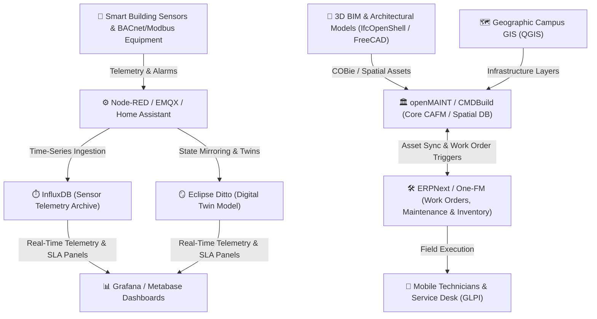

# Awesome-Facility-Management

  

       

---

## 🏢 Top Facility Management Software Ecosystem

> **A Curated Directory of Enterprise SaaS Platforms, Open-Source Repositories, CMMS, CAFM, IWMS, IoT Building Automation & Digital Twin Architectures.**  
> *Focused on Smart Buildings, Operations, Space Planning, Maintenance, Work Orders, Asset Tracking & Workplace Experience.*  
> **📅 Last updated: August 2026**

This repository tracks premier **SaaS/hosted platforms** and **open-source projects** for **Facility Management (FM)**, **Computer-Aided Facility Management (CAFM)**, **Computerized Maintenance Management Systems (CMMS)**, and **Integrated Workplace Management Systems (IWMS)**. These solutions empower facility directors, building operators, maintenance technicians, real-estate managers, and energy engineers to manage smart buildings, physical assets, preventive maintenance, work orders, desk/room occupancy, leasing, ESG/energy sustainability, and vendor logistics.

---

## 📑 Table of Contents

- [🏢 Enterprise SaaS & Hosted Platforms](#-enterprise-saashosted-platforms)
- [⚡ Open-Source GitHub Projects (Ranked by Stars)](#-open-source-github-projects-ranked-by-stars)
- [🧩 Functional Architecture Categories](#-functional-architecture-categories)
- [🏗️ Recommended Self-Hosted FM Blueprint](#️-recommended-self-hosted-fm-blueprint)
- [🤝 How to Contribute](#-how-to-contribute)
- [📈 Star History](#-star-history)
- [⚖️ Disclaimer & License](#️-disclaimer--license)

---

## 🏢 Enterprise SaaS/Hosted Platforms

The following enterprise platforms offer end-to-end facilities management, IWMS, CMMS, space optimization, and IoT building analytics.

*Ranked in descending order by parent company valuation, public market capitalization, or annual revenue.*

| Platform | Company Valuation / Market Cap | Description | Starting Price | Free Tier / Trial Limits |
| :--- | :--- | :--- | :--- | :--- |
| **[IBM TRIRIGA](https://www.ibm.com/products/tririga)** | **~$215B+ Market Cap** ($62.5B+ Rev, NYSE: IBM) | Enterprise IWMS for real estate, facilities, space, lease, capital projects, environmental ESG, and workplace management. | ~$150 / user / month (or ~$10,000 / year base SaaS instance) | No free tier; free guided product tour and IBM sales-assisted test drive environment upon request (0-day self-serve trial) |
| **[ServiceNow Workplace Service Delivery](https://www.servicenow.com/products/workplace-service-delivery.html)** | **~$175B+ Market Cap** ($10.5B+ Rev, NYSE: NOW) | Workplace and facilities service-management suite built on ServiceNow for case management, space reservation, and facilities workflows. | ~$70 / fulfiller user / month (standard enterprise tier) | No free production tier; ServiceNow Personal Developer Instance (PDI) free for 10–15 days of inactivity timeout with development limits |
| **[Brightly](https://www.brightlysoftware.com/)** | **~$165B+ Market Cap** ($85B+ Rev, Siemens AG) | Cloud-based asset management and facility software portfolio supporting maintenance, capital planning, and operational intelligence. | ~$40 / user / month (or ~$2,500 / year base facility package) | No free plan; free personalized demo and operations audit preview upon request (0-day self-serve trial) |
| **[Dude Solutions](https://www.brightlysoftware.com/)** | **~$165B+ Market Cap** (Acquired for $1.58B by Siemens) | Maintenance, facilities, event scheduling, and energy management suite (MaintenanceDirect, EnergyDirect) under Siemens Brightly. | ~$1,500 / year (~$125 / month base facility tier) | No free plan; free custom walkthrough demo and needs consultation (0-day self-serve trial) |
| **[Nuvolo](https://www.nuvolo.com/)** | **~$78B+ Market Cap** (Trane Technologies, NYSE: TT) | Connected Workplace platform built natively on ServiceNow for facilities, clinical EAM, OT cybersecurity, and real estate. | ~$35 / user / month (plus underlying ServiceNow licensing) | No free plan; free customized live demonstration and architectural assessment upon request (0-day self-serve trial) |
| **[Fiix](https://fiixsoftware.com/)** | **~$32B+ Market Cap** ($9.1B+ Rev, Rockwell Automation) | AI-powered cloud CMMS platform for work order management, preventive maintenance, parts inventory, and machine integrations. | $45 / user / month (Basic plan, billed annually) | Free forever plan for up to 3 users (limited to 25 active work orders and 25 assets); plus 14-day free trial of Professional plan |
| **[FM:Systems](https://fmsystems.com/)** | **~$27B+ Parent Rev** (Acquired for $455M by Johnson Controls) | Workplace and facility management platform focused on space planning, workplace experience, occupancy sensors, and real-estate portfolio data. | ~$35 / user / month (or ~$5,000 / year base deployment) | No free plan; free customized live demo and guided product tour upon request (0-day self-serve trial) |
| **[Accruent](https://www.accruent.com/)** | **~$27B+ Market Cap** (Acquired for $2.0B by Fortive, NYSE: FTV) | Comprehensive enterprise asset, facilities, space intelligence, lease administration, and capital planning software portfolio. | ~$85 / user / month (or ~$5,000 / year entry modular suite) | No free plan; 14-day guided evaluation / demo sandbox upon request |
| **[Maintenance Connection](https://www.maintenanceconnection.com/)** | **~$27B+ Market Cap** (Part of Accruent / Fortive) | Enterprise CMMS platform for multi-site maintenance teams, work orders, preventive maintenance, asset tracking, and inventory. | $110 / user / month (Professional edition) | 14-day free trial upon request (single-site sandbox access with demo dataset) |
| **[ServiceChannel](https://servicechannel.com/)** | **~$27B+ Market Cap** (Acquired for $1.2B by Fortive) | Multi-site facilities maintenance platform connecting commercial facility managers with a global contractor network, invoicing, and analytics. | ~$150 / location / month (with annual agreement) | No free tier; free live guided platform demonstration upon request (0-day self-serve trial) |
| **[eMaint](https://www.emaint.com/)** | **~$27B+ Market Cap** (Fluke Reliability / Fortive) | Flexible CMMS platform supporting predictive maintenance, condition monitoring, asset hierarchies, work orders, and mobile field execution. | $69 / user / month (Team plan, 3-user minimum) | 30-day free trial upon demo request (standard CMMS modules for up to 3 test users) |
| **[Yardi](https://www.yardi.com/)** | **~$15B+ Valuation** ($2.0B+ ARR, Private) | Industry-leading real estate and property platform (Voyager & Breeze) covering facility operations, maintenance, lease, and tenant services. | $100 / month minimum ($1 / unit / month for Breeze Residential, $2 / unit / month for Commercial) | No free tier or trial; free live 1-on-1 personalized demo |
| **[Spacewell](https://spacewell.com/)** | **~$11B+ Market Cap** (~€850M Rev, Nemetschek Group) | Integrated workplace and smart building platform combining space management, IoT occupancy sensors, maintenance, and energy analytics. | ~€290 / month (~€3,500 / year base package) | No free plan; free consultative live demo and space utilization assessment upon request (0-day self-serve trial) |
| **[Asset Essentials](https://www.diligent.com/products/asset-essentials)** | **~$7.0B Valuation** ($600M+ Rev, Diligent Corp) | Enterprise CMMS and asset management platform for preventive maintenance schedules, asset condition tracking, and compliance audits. | ~$100 / user / month (or ~$3,000 / year base facility deployment) | No free plan; free personalized product demo and technical feasibility review upon request (0-day self-serve trial) |
| **[Eptura](https://eptura.com/)** | **~$3.5B Valuation** ($400M+ ARR, Thoma Bravo & Clearlake) | Global workplace and asset management platform uniting facility operations, visitor management, room booking, and space planning. | ~$35 / user / month (or ~$3,500 / year starting package) | No free plan; free guided multi-module product demo and solution tour upon request (0-day self-serve trial) |
| **[Archibus](https://eptura.com/our-platform/archibus/)** | **~$3.5B Parent Valuation** (Flagship IWMS of Eptura) | Enterprise facility management and IWMS covering real estate, space planning, environmental impact, building operations, and BIM integration. | ~$50 / user / month (or ~$450 / month base setup) | No free plan; free interactive product demo and sandbox tour upon request (0-day self-serve trial) |
| **[Hippo CMMS](https://www.hippocmms.com/)** | **~$3.5B Parent Valuation** (Part of Eptura Asset Suite) | Intuitive cloud CMMS for maintenance teams managing work orders, equipment lifecycles, preventive maintenance, and spare parts. | $35 / user / month (Starter / Hip Pro plan) | 14-day free trial with full access to work orders and asset management features (no credit card required) |
| **[MRI Software](https://www.mrisoftware.com/)** | **~$3.0B+ Valuation** ($450M+ ARR, TA Associates & Harvest) | Comprehensive real-estate software ecosystem with enterprise facilities management, property operations, space planning, and accounting. | ~$250 / month (or ~$10,000 / year enterprise commercial tier) | No free tier; free product demonstration and portfolio analysis consultation upon request (0-day self-serve trial) |
| **[MRI Manhattan](https://www.mrisoftware.com/)** | **~$3.0B+ Parent Valuation** (Part of MRI Software) | Complete IWMS suite covering real estate planning, lease management, project management, space booking, and facility operations. | ~$500 / month (or ~$6,000 / year base IWMS package) | No free plan; free tailored enterprise demo upon request (0-day self-serve trial) |
| **[FSI](https://www.fsifm.com/)** | **~$3.0B+ Parent Valuation** (MRI Evolution / MRI Software) | Comprehensive CAFM and workplace software ecosystem for mobile workforce dispatching, compliance tracking, and facility help desk. | ~£150 / user / month (~$190 / user / month or £3,000 / year base) | No free plan; free consultative demo and requirement evaluation upon request (0-day self-serve trial) |
| **[Planon](https://planonsoftware.com/)** | **~$1.2B+ Valuation** ($190M+ Rev, Schneider Electric Stake) | Enterprise IWMS platform integrating building IoT, space optimization, lease management, maintenance operations, and sustainability reporting. | ~$60 / user / month (or ~$12,000 / year base platform tier) | No free tier; free proof-of-concept / guided demo sandbox for enterprise evaluations upon request (0-day self-serve trial) |
| **[Planon Workplace](https://planonsoftware.com/)** | **~$1.2B+ Parent Valuation** (Planon Group) | Specialized smart workplace management application for hot desking, meeting room booking, occupancy monitoring, and employee experience. | ~$45 / user / month (or ~$5,000 / year workplace package) | No free tier; free live interactive demo and space management walkthrough (0-day self-serve trial) |
| **[MaintainX](https://www.getmaintainx.com/)** | **$1.0B Unicorn Valuation** ($70M+ ARR, Bessemer & Bain) | Mobile-first digital work order, procedure checklist, and maintenance platform built for frontline technicians and industrial facilities. | $21 / user / month (Essential plan, billed annually) | Free forever Basic plan with unlimited work orders and requests (limited to 2 active repeat work orders/month and basic metrics); plus 30-day free trial of Premium plan |
| **[Limble CMMS](https://limblecmms.com/)** | **~$450M Valuation** ($40M+ ARR, Goldman Sachs Growth) | Modern, highly modular CMMS designed for automated work orders, preventive maintenance scheduling, IoT sensor triggers, and parts management. | $28 / user / month (Standard plan, billed annually) | Free forever plan for unlimited users (limited to 1 work request portal, basic work orders, and 20 assets); plus 30-day free trial of Pro tier |
| **[CAFM Explorer](https://www.cafmexplorer.com/)** | **~$400M Market Cap** (~£320M, Idox plc, LON: IDOX) | Specialized CAFM platform for managing buildings, assets, maintenance tickets, compliance logs, room bookings, and space allocation. | ~$400 / month (or ~$4,800 / year single-site base setup) | No free plan; free scheduled demonstration with sample facilities dataset (0-day self-serve trial) |
| **[UpKeep](https://www.onupkeep.com/)** | **~$350M Valuation** ($30M+ ARR, Insight Partners) | Mobile-centric CMMS and asset operations management platform for work order tracking, inventory parts control, and field inspections. | $20 / user / month (Lite plan, billed annually) | 7-day free trial of Business Plus tier (unlimited work orders and users during trial, no credit card required) |
| **[OfficeSpace](https://www.officespacesoftware.com/)** | **~$200M Valuation** ($35M+ ARR, Resurgens Tech) | Hybrid workplace platform dedicated to office floor plan visualization, dynamic desk reservation, move management, and space analytics. | ~$2.50 – $3.50 / seat / month (or ~$300 / month minimum) | No free plan; free interactive self-guided product tour and scheduled live demo (0-day self-serve trial) |
| **[Facilio](https://facilio.com/)** | **~$150M Valuation** ($45M Raised, Accel & Tiger Global) | IoT-driven connected operations platform unifying HVAC controls, asset maintenance, energy analytics, and fault detection across multi-site portfolios. | ~$833 / month (~$10,000 / year entry platform tier) | No free plan; free interactive 1-on-1 demo and IoT facility assessment upon request (0-day self-serve trial) |
| **[eFACiLiTY](https://www.efacility.in/)** | **~$100M Valuation** ($25M+ Annual Rev, SIERRA ODC) | Modular CAFM / EAM suite spanning equipment maintenance, visitor management, environmental dashboards, and building automation integration. | ~$800 / month (entry modular EAM / CAFM licensing) | No free plan; 30-day proof-of-concept sandbox trial upon vendor qualification and demo |
| **[FMX](https://www.gofmx.com/)** | **~$75M Valuation** ($18M+ ARR, Growth Equity Backed) | Facility management and maintenance software for work orders, preventative maintenance, equipment logging, and community space scheduling. | $35 / user / month (or ~$300 / month base tier) | 14-day free trial with full access to work orders, scheduling, and preventive maintenance modules |
| **[AkitaBox](https://akitabox.com/)** | **~$50M Valuation** ($20M Raised, Series A/B Backed) | Visual building data management and facility condition assessment platform utilizing 2D/3D floor plans for pinpointing maintenance assets. | ~$0.04 / sq. ft. / year (or ~$350 / month base setup) | No free plan; free custom 3D building visual walkthrough and demo upon request (0-day self-serve trial) |

> **Industry resource:** [FieldServiceScout](https://www.fieldservicescout.com/compare/jobber-vs-housecall-pro) provides an independent Jobber vs Housecall Pro comparison for trade shops, including features and modeled true cost.

---

## ⚡ Open-Source GitHub Projects (Ranked by Stars)

Open-source tools, frameworks, and libraries for creating self-hosted, sovereign facility management systems, building automation gateways, smart IoT telemetry pipelines, and OpenBIM digital twins.

*Ranked in descending order by GitHub stargazers.*

1. **[Home Assistant](https://github.com/home-assistant/core)**   
   Open-source home and building automation platform with over 2,500 integrations for HVAC controls, lighting, energy meters, occupancy sensors, and environmental monitoring. Acts as an edge IoT gateway for facility managers.

2. **[Grafana](https://github.com/grafana/grafana)**   
   Industry-standard observability and visualization platform for composing real-time smart facility dashboards, energy telemetry monitoring, temperature heatmaps, and maintenance SLA metrics.

3. **[Apache Superset](https://github.com/apache/superset)**   
   Enterprise-ready business-intelligence and data exploration tool tailored for high-volume facility operational reporting, spatial utilization analysis, and energy consumption forecasting.

4. **[Metabase](https://github.com/metabase/metabase)**   
   Self-service BI tool enabling facility teams and non-technical staff to run queries, build visual work-order boards, track preventive maintenance cycles, and share facility KPIs.

5. **[PostHog](https://github.com/PostHog/posthog)**   
   Product and behavior analytics platform adaptable for smart building kiosks, room check-in interactions, desk-booking touchpoints, and workplace experience telemetry.

6. **[ERPNext](https://github.com/frappe/erpnext)**   
   Full-featured open-source ERP platform with native asset lifecycle tracking, maintenance schedules, work order ticketing, spare parts procurement, and field technician dispatching.

7. **[FreeCAD](https://github.com/FreeCAD/FreeCAD)**   
   Parametric 3D CAD/BIM modeler for facility engineering, mechanical equipment modeling, architectural plans, and spatial geometry verification.

8. **[InfluxDB](https://github.com/influxdata/influxdb)**   
   High-performance time-series database designed for ingesting high-frequency building sensor streams (HVAC temperatures, submetered energy wattage, humidity, airflow, and air quality).

9. **[Node-RED](https://github.com/node-red/node-red)**   
   Low-code flow-based integration platform for bridging physical facility hardware, BACnet/Modbus/OPC-UA industrial gateways, smart thermostats, REST APIs, and automated work orders.

10. **[ThingsBoard](https://github.com/thingsboard/thingsboard)**   
    Open-source IoT platform for device connectivity, telemetry ingestion, rule engines, smart-building alarms, and customizable facility monitoring dashboards.

11. **[NetBox](https://github.com/netbox-community/netbox)**   
    Infrastructure resource management (DCIM / IPAM) platform ideal for documenting campus data centers, equipment racks, facility network layouts, and electrical power feeds.

12. **[EMQX](https://github.com/emqx/emqx)**   
    Ultra-scalable distributed MQTT broker engineered for large-scale smart buildings, smart campus sensor grids, and industrial IoT machine communication.

13. **[OpenProject](https://github.com/opf/openproject)**   
    Open-source project management suite with Gantt charts, BIM integration, and cost tracking suited for building renovations, capital improvement projects, and facility construction.

14. **[Snipe-IT](https://github.com/snipe/snipe-it)**   
    Open-source IT and physical asset management platform for tracking hardware, office equipment, serial numbers, warranty lifecycles, user checkouts, and maintenance records.

15. **[QGIS](https://github.com/qgis/QGIS)**   
    Professional Geographic Information System (GIS) application for spatial mapping of facility campuses, building boundaries, underground utilities, infrastructure, and field operations.

16. **[Frappe Framework](https://github.com/frappe/frappe)**   
    Full-stack Python/JS web framework powering ERPNext, ideal for building tailored facility request portals, custom approval chains, maintenance ticketing desks, and asset schemas.

17. **[Grocy](https://github.com/grocy/grocy)**   
    Self-hosted web application for equipment maintenance tracking, consumable inventory management, task scheduling, and household/facility asset upkeep.

18. **[InvenTree](https://github.com/inventree/InvenTree)**   
    Lightweight, modular inventory and parts management system featuring barcode scanning, stock tracking, bill of materials (BOM), supplier directories, and maintenance logs.

19. **[GLPI](https://github.com/glpi-project/glpi)**   
    Comprehensive open-source service management (ITSM) and asset inventory platform for managing facility support tickets, equipment lifecycles, supplier contracts, and vendor SLAs.

20. **[Zenoh](https://github.com/eclipse-zenoh/zenoh)**   
    Zero-overhead pub/sub and query protocol designed for edge computing, robotics, and smart building sensor networks with ultra-low latency and minimal footprint.

21. **[IfcOpenShell (Bonsai / BlenderBIM)](https://github.com/IfcOpenShell/IfcOpenShell)**   
    Open-source IFC and OpenBIM toolkit with Python bindings and Blender integration for parsing 3D architectural models, managing COBie facility data, and bridging BIM to CAFM.

22. **[Ralph](https://github.com/allegro/ralph)**   
    Open-source asset management, DCIM, and CMMS for hardware tracking, data center floor plans, physical office assets, licensing, and lifecycle transitions.

23. **[OpenRemote](https://github.com/openremote/openremote)**   
    Smart building and IoT automation platform with rule engines, geofencing, energy optimization algorithms, custom dashboard designers, and mobile client apps.

24. **[iTop](https://github.com/Combodo/iTop)**   
    Configurable open-source CMDB and service desk solution for mapping physical infrastructure relationships, facility helpdesk workflows, and asset dependencies.

25. **[openHAB](https://github.com/openhab/openhab-core)**   
    Vendor-agnostic smart home and building automation runtime integrating diverse automation technologies, lighting protocols, HVAC sensors, and energy sub-meters.

26. **[Eclipse Ditto](https://github.com/eclipse-ditto/ditto)**   
    Open-source IoT digital twin framework providing state mirrors, APIs, and access control for real-world facility devices, smart equipment, and HVAC units.

27. **[Grash CMMS](https://github.com/Grashjs/cmms)**   
    Self-hosted, modern open-source CMMS web and mobile application for managing enterprise work orders, scheduled preventive maintenance, and technician rosters.

28. **[BACnet Stack](https://github.com/bacnet-stack/bacnet-stack)**   
    Open-source C implementation of the ANSI/ASHRAE/ISO BACnet protocol for integrating commercial Building Automation Systems (BAS), chillers, and HVAC controllers.

29. **[Eclipse VOLTTRON](https://github.com/VOLTTRON/volttron)**   
    Distributed IoT agent platform developed by PNNL/DOE for building energy management, demand response, microgrid coordination, and sensor diagnostics.

30. **[Ladybug Tools](https://github.com/ladybug-tools/ladybug)**   
    Environmental building analysis and energy modeling library for evaluating solar exposure, daylight illumination, thermal comfort, and HVAC energy loads.

31. **[T3000 Building Automation System](https://github.com/temcocontrols/T3000_Building_Automation_System)**   
    Open-source Building Management System (BMS) front-end supporting BACnet, Modbus, custom graphical floor plans, and field controller programming.

32. **[One-FM](https://github.com/ONE-F-M/One-FM)**   
    Specialized facility management suite built on ERPNext designed for commercial property operations, security patrols, contractor compliance, and maintenance workflows.

33. **[Beveren Field Service Management](https://github.com/Beveren-Software-Inc/Field_Service_Management)**   
    ERPNext field-service application for scheduling technician visits, managing work tickets on-site, recording spare parts usage, and generating work invoices.

34. **[openMAINT](https://www.openmaint.org/)**  
    A specialized open-source Property & Facility Management system based on the CMDBuild enterprise architecture, covering spatial hierarchies, preventive maintenance, GIS integration, and BIM data models.

---

## 🧩 Functional Architecture Categories

| Category | Primary Functional Scope | Key Open-Source Building Blocks |
| :--- | :--- | :--- |
| **🛠️ CMMS & Work Orders** | Preventive maintenance, work order dispatch, spare parts, inspections, technician tracking | [ERPNext](https://github.com/frappe/erpnext), [Grash CMMS](https://github.com/Grashjs/cmms), [Snipe-IT](https://github.com/snipe/snipe-it), [InvenTree](https://github.com/inventree/InvenTree) |
| **🏢 CAFM & Space Management** | Room booking, desk occupancy, floor plans, physical asset hierarchies, move planning | [openMAINT](https://www.openmaint.org/), [One-FM](https://github.com/ONE-F-M/One-FM), [NetBox](https://github.com/netbox-community/netbox), [Ralph](https://github.com/allegro/ralph) |
| **🌐 Smart Building IoT & BMS** | Sensor ingestion, BACnet/Modbus gateways, smart lighting, HVAC automation | [Home Assistant](https://github.com/home-assistant/core), [ThingsBoard](https://github.com/thingsboard/thingsboard), [OpenRemote](https://github.com/openremote/openremote), [Node-RED](https://github.com/node-red/node-red), [EMQX](https://github.com/emqx/emqx) |
| **⚡ Energy & Environmental Telemetry** | Power submetering, HVAC runtime, indoor air quality (IAQ), carbon emission analytics | [InfluxDB](https://github.com/influxdata/influxdb), [Grafana](https://github.com/grafana/grafana), [Eclipse VOLTTRON](https://github.com/VOLTTRON/volttron), [Ladybug Tools](https://github.com/ladybug-tools/ladybug) |
| **📐 OpenBIM, IFC & GIS** | 3D digital twins, COBie facility handover, campus GIS mapping, spatial utilities | [IfcOpenShell](https://github.com/IfcOpenShell/IfcOpenShell), [FreeCAD](https://github.com/FreeCAD/FreeCAD), [QGIS](https://github.com/qgis/QGIS), [Eclipse Ditto](https://github.com/eclipse-ditto/ditto) |
| **📊 Analytics & Service Desk** | Facility service request portals, KPI dashboards, executive SLA reporting | [Metabase](https://github.com/metabase/metabase), [Apache Superset](https://github.com/apache/superset), [GLPI](https://github.com/glpi-project/glpi), [iTop](https://github.com/Combodo/iTop) |

---

## 🏗️ Recommended Self-Hosted FM Blueprint

For organizations desiring an open-source, sovereign facility management stack:

---

## 🤝 How to Contribute

We welcome contributions from facility managers, building engineers, software developers, and open-source advocates!

1. 🍴 **Fork the repository**.
2. 🌿 **Create a descriptive feature branch** (`git checkout -b add-awesome-fm-tool`).
3. 📝 **Add or update entries in [README.md](README.md)** (maintain tabular pricing format for SaaS and star badges with stargazers links for open-source repos).
4. 🔍 **Verify links, transparent pricing notes, and factual descriptions**.
5. 🚀 **Submit a Pull Request** with a summary of the additions.

---

## 📈 Star History

---

## ⚖️ Disclaimer & License

- **Disclaimer**: This curated list is maintained for educational and informational purposes. Product names, logos, and trademarks belong to their respective owners. SaaS pricing tiers, terms, and features are subject to vendor updates.
- **Open-Source Licenses**: Licensing terms vary across open-source repositories; always verify individual licenses before commercial adoption.
- **License**: Distributed under the [MIT License](LICENSE).

---

  <b>Built with ❤️ for facility managers, workplace planners, building operators, and smart facility technologists worldwide.</b>

